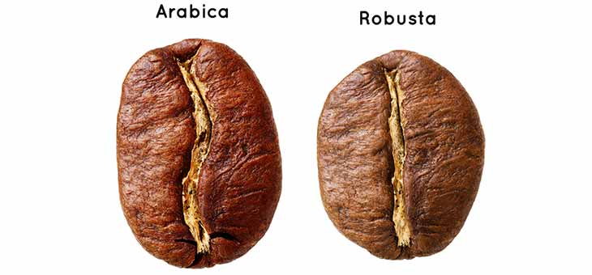

```{r setup, include=FALSE}
options(htmltools.dir.version = FALSE)
knitr::opts_chunk$set(echo = FALSE,
                      fig.align = "center")
```

```{r xaringan-themer, message=FALSE, warning=FALSE, include=FALSE }
library(xaringanthemer)
library(xaringanExtra)
library(tidyverse)
library(leaflet)
library(patchwork)
library(anicon)
library("countdown")
library(calendR)
library(lubridate)
library(readr)
library(kableExtra)
library(maps)
library(knitr)
library(dplyr)
library(hrbrthemes)
library(viridis)

style_duo_accent(
  primary_color = "#1381B0",
  secondary_color = "#FF961C",
  inverse_header_color = "#FFFFFF"
)

xaringanExtra::use_panelset()

```
class: title-slide, my-one-page-font 

.center[.black[ETC5513: Final Presentation:] <br> .brown[Exploring Coffee Varieties]]
<br>

.left[.black[Authors:] <br><br>
.pink[Sahinya Akila] <br><br>
.pink[Stylianos Panagiotis] <br><br>
.pink[Yiwen Liu] <br><br>
]  <br>

_.left[`r Sys.Date()`]_


.footer[`r icon::fa('book')` ETC5513:Collaborative and reproducible practices]

---
class: middle center bg-main1

# 咖啡

--
## .blue[The Japanese word for Coffee]

--


--

This slide is a tribute to _Yihui Xie_ creator of __[xaringan]("https://slides.yihui.org/xaringan/#1")__


---
```{r reading-data, echo = FALSE, message = FALSE, warning = FALSE}
# Get the Data
coffee_data <- read_csv(here::here("Data/coffee_ratings.csv"))
```


## .white[Which countries produce most kinds of Arabica and Robusta coffee beans]

.panelset[
.panel[.panel-name[Summary]

.center[

]


]

.panel[.panel-name[Table]

```{r, echo=FALSE, message=FALSE}
species_country <- coffee_data %>% 
  select(country_of_origin, species)

species_country_count <- species_country %>% 
  group_by(country_of_origin, species) %>% 
  summarise(n=n()) %>% 
  arrange(-n) %>%
  ungroup() %>% 
  group_by(species) %>% 
  slice(1:3)

species_country_count %>% 
  kable() %>% 
  kable_styling()

```

]
.panel[.panel-name[Plot]

```{r, echo=FALSE, fig.width=12, fig.height=7}
# world map
world_map <- map_data("world")

# top3 country geo data of two species
top3country <- map_data("world", region = species_country_count$country_of_origin)

# combine top3 country geo data of two species with count data
top3country_geo_count <- top3country %>% 
  left_join(species_country_count, by = c("region"="country_of_origin"))

ggplot(world_map, aes(x = long, y = lat, group = group)) +
  geom_polygon(fill="white", colour = "gray50") +
  geom_polygon(data =top3country_geo_count, aes(x=long, y = lat, group=group,fill=species))+
  scale_x_continuous(breaks = seq(-180, 210, 45), labels = function(x){paste0(x, "°")}) +
  scale_y_continuous(breaks = seq(-60, 100, 30), labels = function(x){paste0(x, "°")}) +
  annotate("text", label = "Colombia", x = -74.2973, y = 4.5709, size = 3)+
  annotate("text", label = "Mexico", x = -102.5528, y = 23.6345, size = 3)+
  annotate("text", label = "Guatemala", x = -90.2308, y = 15.7835, size = 3)+
  annotate("text", label = "India", x = 78.9629, y = 20.5937, size = 3)+
  annotate("text", label = "Uganda", x = 32.2903, y = 1.3733, size = 3)+
  annotate("text", label = "Ecuador", x = -78.1834, y = -1.8312, size = 3)+
  theme_light()

```


]
]

---
## .white[Difference of altitude of Arabica coffee beans and Robusta coffee beans production]

.panelset[
.panel[.panel-name[Summary]


]

.panel[.panel-name[Plot]

```{r, echo=FALSE, fig.width=12, fig.height=6}
coffee_data %>% 
  select(species, altitude_mean_meters) %>% 
  drop_na() %>% 
  filter(altitude_mean_meters<=5900) %>% 
  pivot_longer(-species, names_to = "altitude", values_to = "meter") %>% 
  ggplot(aes(x = meter, color = species)) +
  geom_density()

```


]
]

---
## .white[Which species has higher grades]

.panelset[
.panel[.panel-name[Summary]


]

.panel[.panel-name[Plot]

```{r, echo=FALSE, , fig.width=12, fig.height=6}
species_grades <- coffee_data %>% 
  select(total_cup_points,species,aroma,flavor,aftertaste,acidity,sweetness) %>% 
  filter(total_cup_points != 0)

species_grades %>% 
  pivot_longer(-species, names_to = "measure", values_to = "grades") %>% 
  mutate(species = as.factor(species),
         measure = as.factor(measure)) %>% 
  ggplot(aes(x = species, y = grades, color=species)) +
  geom_boxplot()+
  facet_wrap(~measure, scales = "free_y") +
  labs(x = "")

```


]
]


---
## .white[Which processing method leads to better rating]

.panelset[
.panel[.panel-name[Summary]


]

.panel[.panel-name[Plot]

```{r, echo=FALSE, , fig.width=12, fig.height=6}
processing_method <- coffee_data %>% 
  select(processing_method:cupper_points) %>% 
  filter(!is.na(processing_method))

processing_method$mean <- rowMeans(subset(processing_method, select = c(aroma, flavor, aftertaste, acidity, body, balance, uniformity, clean_cup, sweetness, cupper_points)), na.rm = TRUE)

ggplot(processing_method, aes(x=processing_method, y=mean, fill=processing_method)) +
    geom_violin() +
    scale_fill_viridis(discrete = TRUE, alpha=0.6, option="A") +
    theme(
      legend.position="none",
      plot.title = element_text(size=11)
    ) +
    ggtitle("Distribution of Coffee Ratings based on Processing method") +
    xlab("Processing Method")

```


]
]


---
## .white[Which harvest year produces the best coffee?]

.panelset[
.panel[.panel-name[Summary]


]

.panel[.panel-name[Plot]

```{r, echo=FALSE, , fig.width=12, fig.height=6}
best_coffee <- coffee_data %>% 
  filter(str_detect(harvest_year, "^[1-9][0-9][0-9][0-9]$"))

best_coffee$mean <- best_coffee$mean <- rowMeans(subset(best_coffee, select = c(aroma, flavor, aftertaste, acidity, body, balance, uniformity, clean_cup, sweetness, cupper_points)), na.rm = TRUE)

ggplot(best_coffee, aes(harvest_year, mean)) +
  geom_col(fill = "#8B4513") +
    theme(
      legend.position="none",
      plot.title = element_text(size=11)
    ) +
  ggtitle("Coffee Ratings in each harvest year") +
    xlab("Harvest Year") +
    ylab("Average Coffee Rating")
```


]
]


